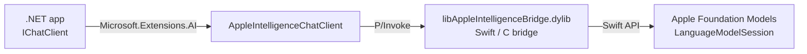

# Community.Microsoft.Extensions.AI.CoreML

[](https://www.nuget.org/packages/Community.Microsoft.Extensions.AI.CoreML)
[](LICENSE)
[](https://developer.apple.com/documentation/foundationmodels)

> **Use Apple Intelligence on-device models directly from .NET — through the familiar `IChatClient` interface.**

---

## What is it?

`Community.Microsoft.Extensions.AI.CoreML` is an open-source [`IChatClient`](https://learn.microsoft.com/dotnet/ai/microsoft-extensions-ai) implementation that talks **directly** to Apple's on-device Foundation Models (Apple Intelligence) from .NET — no MAUI workload, no local HTTP server, no cloud calls.

The same `IChatClient` you already use with OpenAI, Azure OpenAI, or Ollama now works against the private, on-device model that ships with every Apple Silicon Mac running macOS 26+.

**Why use it?**

- 🆓 **Free** — no API costs, no rate limits
- 🔒 **Private** — prompts and responses never leave the device
- ⚡ **Fast** — no network hop
- ✈️ **Offline** — works without internet
- 🪶 **Lightweight** — a single NuGet package that bundles a small native bridge dylib; no MAUI required

**What's inside?**



Supports plain completions, streaming, multi-turn conversations, **and tool / function calling** (compatible with `Microsoft.Agents.AI`).

For a deeper look at the design, see [docs/architecture.md](docs/architecture.md).
For release automation and publishing steps, see [docs/releasing.md](docs/releasing.md).

---

## How to install

### Requirements

| Requirement | Version |
|---|---|
| macOS | 26.0 or later |
| Architecture | Apple Silicon (M1 or later) |
| Apple Intelligence | Enabled in System Settings → Apple Intelligence & Siri |
| .NET | 10.0 or later |

> The package ships the pre-built native bridge dylib for `osx-arm64`. Other platforms throw `PlatformNotSupportedException` at construction.

Add the package:

```sh
dotnet add package Community.Microsoft.Extensions.AI.CoreML --prerelease
```

---

## How to use it

### 1. Basic completion

```csharp
using Community.Microsoft.Extensions.AI.CoreML;
using Microsoft.Extensions.AI;

IChatClient client = new AppleIntelligenceChatClient();

var response = await client.GetResponseAsync(
    "Summarise the key ideas of stoicism in three bullet points.");

Console.WriteLine(response.Text);
```

### 2. Streaming

```csharp
await foreach (var update in client.GetStreamingResponseAsync("Tell me a short story."))
{
    Console.Write(update.Text);
}
```

### 3. Multi-turn conversation

```csharp
var history = new List<ChatMessage>
{
    new(ChatRole.System, "You are a concise assistant."),
    new(ChatRole.User,   "What is the capital of Belgium?"),
};

var reply = await client.GetResponseAsync(history);
history.AddRange(reply.Messages);

history.Add(new ChatMessage(ChatRole.User, "And of France?"));
var follow = await client.GetResponseAsync(history);
Console.WriteLine(follow.Text);
```

### 4. Dependency injection

```csharp
using Community.Microsoft.Extensions.AI.CoreML;

services
    .AddAppleIntelligenceChatClient()
    .UseFunctionInvocation();   // any IChatClient middleware works here
```

Then inject `IChatClient` anywhere:

```csharp
public class ChatService(IChatClient client)
{
    public Task<ChatResponse> AskAsync(string prompt) =>
        client.GetResponseAsync(prompt);
}
```

### 5. Tool / function calling

Works out of the box with `Microsoft.Agents.AI`:

```csharp
using Microsoft.Agents.AI;
using Microsoft.Extensions.AI;

string GetWeather(string location) => $"It is cloudy in {location} with a high of 15°C.";

var agent = new AppleIntelligenceChatClient()
    .AsAIAgent(
        name: "WeatherAgent",
        instructions: "You are a helpful weather assistant.",
        tools: [AIFunctionFactory.Create(GetWeather, "GetWeather", "Get the weather for a given location.")]);

var reply = await agent.RunAsync("What's the weather in New York?");
Console.WriteLine(reply.Messages.Last().Text);
// → "It is cloudy in New York with a high of 15°C."
```

---

## Leave feedback

This project is **brand new** and **community-driven** — your feedback genuinely shapes where it goes next.

- 🐛 **Found a bug?** → [Open an issue](https://github.com/fvandepitte/Community.Microsoft.Extensions.AI.CoreML/issues/new?labels=bug)
- 💡 **Have an idea or feature request?** → [Open an issue](https://github.com/fvandepitte/Community.Microsoft.Extensions.AI.CoreML/issues/new?labels=enhancement)
- 💬 **Want to discuss usage, share what you built, or ask a question?** → [Start a discussion](https://github.com/fvandepitte/Community.Microsoft.Extensions.AI.CoreML/discussions)
- ⭐ **Like the project?** → A GitHub star is the easiest way to tell us it's useful

When reporting a bug, please include:

- macOS version (`sw_vers -productVersion`)
- .NET SDK version (`dotnet --version`)
- A minimal repro (a few lines of code + the exception or unexpected output)

---

## License

[MIT](LICENSE) — © Community Contributors
