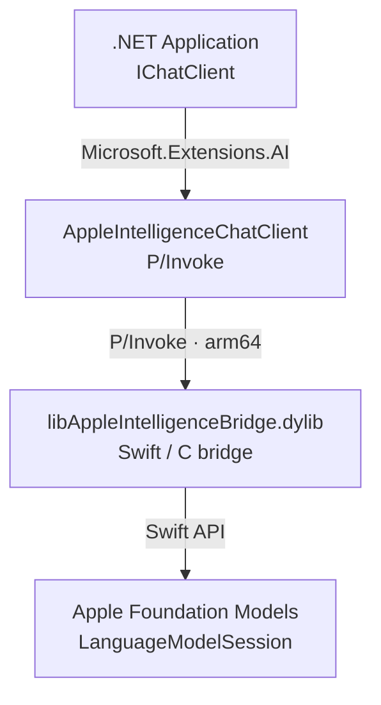

# Community.Microsoft.Extensions.AI.CoreML

[](LICENSE)
[](https://developer.apple.com/documentation/foundationmodels)

> **Use Apple Intelligence on-device models directly from .NET — no MAUI, no cloud, no API keys.**

---

## What is this?

`Community.Microsoft.Extensions.AI.CoreML` is an open-source `IChatClient` implementation for the [`Microsoft.Extensions.AI`](https://learn.microsoft.com/en-us/dotnet/ai/microsoft-extensions-ai) abstraction that talks **directly** to Apple's on-device Foundation Models (Apple Intelligence) via P/Invoke — no network calls, no MAUI dependencies.

This lets you use the same `IChatClient` interface you already know from OpenAI/Azure OpenAI, but backed by the private, local model that runs on any Apple Silicon Mac with macOS 26+.

## Why?

Apple Intelligence runs fully on-device, which means:

- **Free** — no API costs
- **Private** — data never leaves your machine
- **Fast** — no network latency
- **Offline** — works without internet

The catch: Apple's Foundation Models framework is a Swift/Objective-C API. Existing .NET solutions require installing the full MAUI workload. This library instead ships a **thin native C bridge** (compiled as a `.dylib`) that is P/Invoked from C#, making the dependency footprint minimal.

## Requirements

| Requirement | Version |
|---|---|
| macOS | 26 Beta 2 or later |
| Architecture | Apple Silicon (M1 or later) |
| Apple Intelligence | Enabled in System Settings |
| .NET | 8.0 or later |
| Xcode (to build the native bridge) | 26 Beta 2 or later |

## Installation

```sh
dotnet add package Community.Microsoft.Extensions.AI.CoreML
```

> ⚠️ The NuGet package bundles the pre-built native bridge dylib for macOS arm64. No separate installation is required.

## Quick Start

```csharp
using Community.Microsoft.Extensions.AI.CoreML;
using Microsoft.Extensions.AI;

IChatClient client = new AppleIntelligenceChatClient();

var response = await client.GetResponseAsync([
    new ChatMessage(ChatRole.User, "Summarise the key ideas of stoicism in three bullet points.")
]);

Console.WriteLine(response.Text);
```

### Dependency Injection

```csharp
builder.Services.AddChatClient(
    new AppleIntelligenceChatClient()
);
```

## How it Works



The library ships a thin **Swift C-bridge** (`@_cdecl` exported functions) compiled into a native dylib. The C# layer P/Invokes these functions and maps them to the `IChatClient` / `IStreamingChatClient` contracts.

For more detail see [docs/architecture.md](docs/architecture.md).

## Related Projects

- [apfel](https://github.com/apfel-ai/apfel) — Apple Intelligence CLI & OpenAI-compatible HTTP server (Swift)
- [apple-on-device-openai](https://github.com/gety-ai/apple-on-device-openai) — SwiftUI app exposing Foundation Models as OpenAI server
- [Microsoft.Extensions.AI](https://learn.microsoft.com/en-us/dotnet/ai/microsoft-extensions-ai) — the abstraction this library implements

## Contributing

Contributions are welcome! See [docs/plan.md](docs/plan.md) for the current implementation roadmap.

1. Fork the repo
2. Create a feature branch
3. Submit a PR against `main`

## License

[MIT](LICENSE) — © Community Contributors

