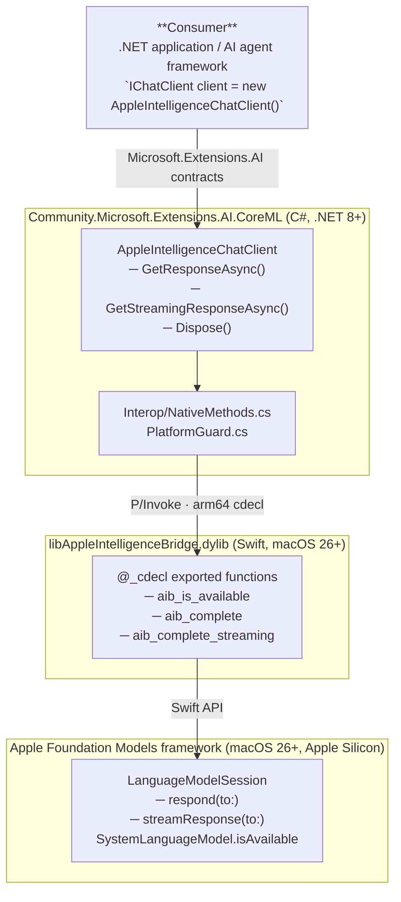

# Architecture

## Overview



---

## Component Descriptions

### `AppleIntelligenceChatClient`

The public entry point. Implements `IChatClient` from `Microsoft.Extensions.AI`.

- Uses stateless bridge calls; no native session pointer is retained on the C# side.
- Converts `IList<ChatMessage>` into a prompt string for the Foundation Models API.
- Maps native responses back to `ChatResponse` / `ChatResponseUpdate`.

### `NativeMethods.cs` (Interop layer)

Uses the .NET 7+ `[LibraryImport]` source-generated P/Invoke to call into the native bridge dylib.

The dylib is resolved from `runtimes/osx-arm64/native/libAppleIntelligenceBridge.dylib` via the standard .NET native library resolution path.

```csharp
internal static partial class NativeMethods
{
    private const string LibName = "AppleIntelligenceBridge";

    [LibraryImport(LibName, EntryPoint = "aib_is_available")]
    [return: MarshalAs(UnmanagedType.Bool)]
    internal static partial bool IsAvailable();

    [LibraryImport(LibName, EntryPoint = "aib_complete")]
    internal static partial void Complete(...);

    [LibraryImport(LibName, EntryPoint = "aib_complete_streaming")]
    internal static partial void CompleteStreaming(...);
}
```

### Callback strategy for streaming

The native bridge uses C-style function-pointer callbacks. Streaming works as follows:

1. C# creates a GC-pinned `delegate` matching the callback signature.
2. C# calls `aib_complete_streaming`, passing the delegate as a function pointer.
3. The Swift bridge invokes the callback once per streamed token/chunk.
4. C# unpins the delegate only after the terminal call (where `isDone == true`).

This avoids the need for unsafe code in the consumer or complex interop buffers.

### Platform guard

`PlatformGuard.ThrowIfNotSupported()` is called in the constructor of `AppleIntelligenceChatClient`. It throws `PlatformNotSupportedException` on:

- Non-macOS operating systems
- macOS running on x86-64 (Intel Macs)

---

## Native Bridge: Swift `@_cdecl` API

The bridge is intentionally minimal — all AI logic stays in Swift/Objective-C; the C# layer only marshals data.

### Memory ownership rules

| Pointer | Owned by | Freed by |
|---|---|---|
| `CChar*` messages JSON passed in | C# | C# (stays valid for duration of call) |
| `CChar*` result passed to callback | Swift | Swift (copy before returning from callback) |

### Thread safety

The bridge is stateless across calls: each `aib_complete` / `aib_complete_streaming` invocation creates a fresh `LanguageModelSession` in Swift and does not expose a long-lived native session handle to C#.

---

## NuGet Package Layout

```
Community.Microsoft.Extensions.AI.CoreML.nupkg
├── lib/
│   └── net8.0/
│       └── Community.Microsoft.Extensions.AI.CoreML.dll
└── runtimes/
    └── osx-arm64/
        └── native/
            └── libAppleIntelligenceBridge.dylib
```

---

## Build Requirements

| Component | Tool |
|---|---|
| C# library | `dotnet build` |
| Native bridge dylib | Xcode 26 beta / `swiftc` on macOS 26 arm64 |
| Full NuGet package | Build dylib first, then `dotnet pack` |

The `native/` directory contains the Swift package. Run `make bridge` (or the provided script) to compile `libAppleIntelligenceBridge.dylib` and copy it to the correct `runtimes/` path before packing.
